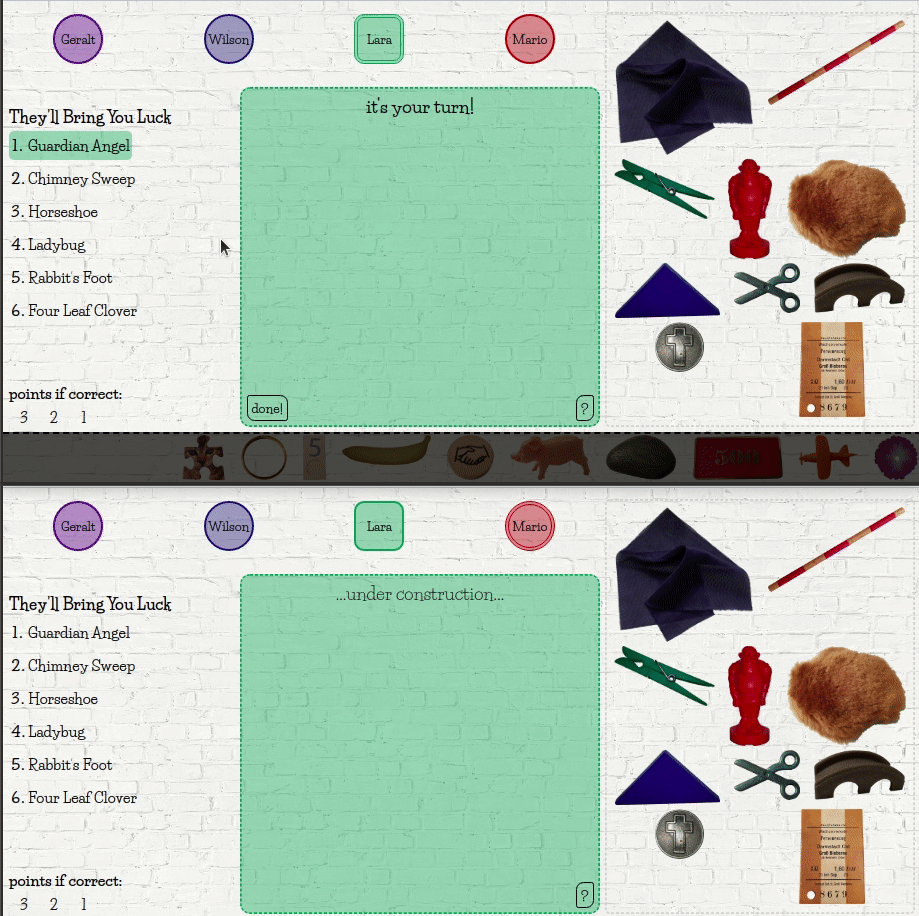
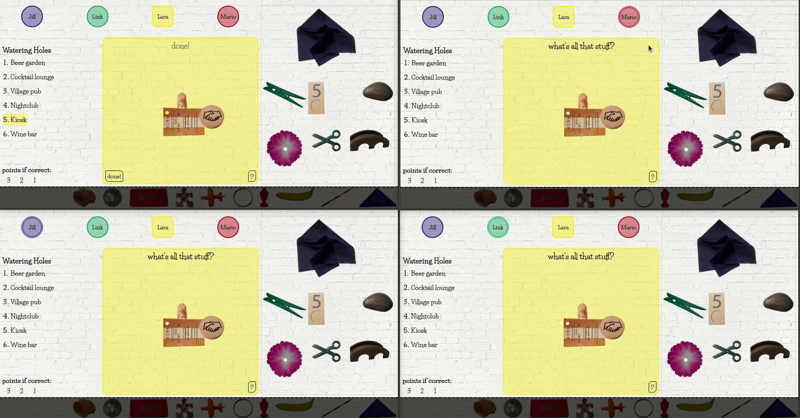
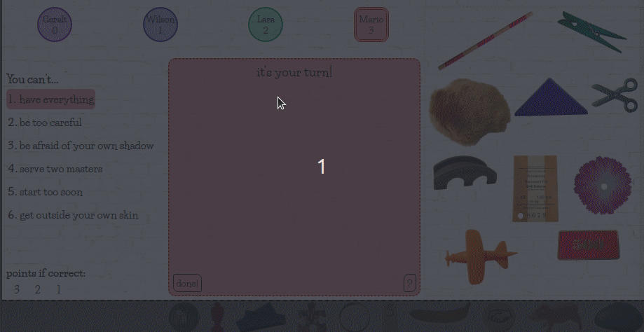
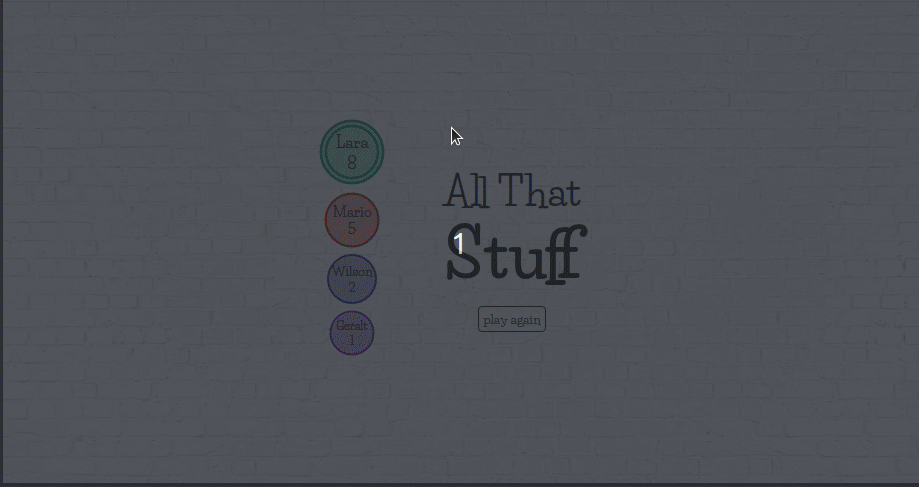

# AllThatStuff
Multiplayer word association game

## Features
* Players take turns
* Select and drag&drop elements to make the other players guess a word
* Live update of moving elements for all players

## Technologies
HTML5, CSS3, JavaScript, jQuery, Socket.IO

## Preview
### START MENU

### MAIN GAME

BUILDING:

GUESSING:

NEXT TURN:

### GAME END

## Links & more
* look at the [word cards](https://ninahahne.github.io/AllThatStuff/cards)

* [cards json file](https://ninahahne.github.io/AllThatStuff/cards_enUS.json)
